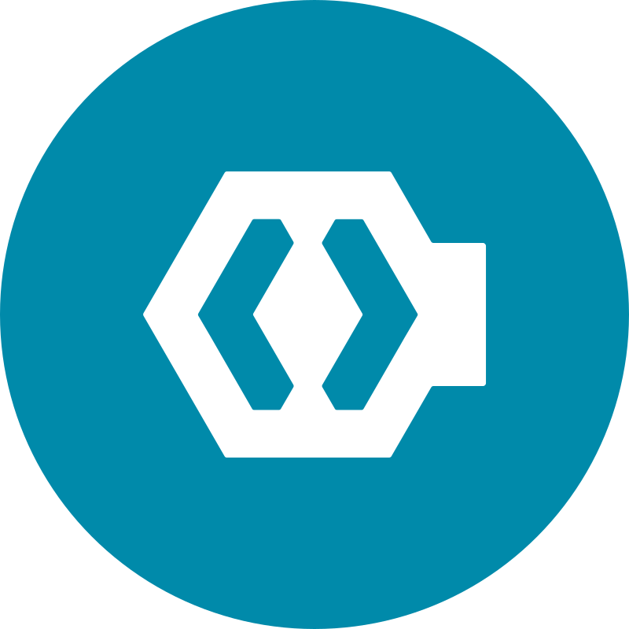

<p align="center">
     &nbsp; &nbsp; &nbsp; &nbsp;
    
</p>

<p align="center">
    <strong>LARAVEL | KEYCLOAK</strong>
</p>

<hr>

**INTRODUÇÃO**

Este projeto demonstra como autenticar usuários em uma aplicação Laravel através do Keycloak e para executar o projeto você precisará ter o Docker (docker-compose) instalado em sua máquina, caso necessite de ajuda  para suporte em relação à instalação/uso de docker, mas os comando sugeridos neste documento serão suficientes para execução do projeto. <br>

Veja abaixo as tecnologias destacadas neste projeto com suas respectivas documentações:
- [DOCKER](https://docs.docker.com/?_gl=1*1xjbi54*_ga*MTMzNDU3NTI4My4xNjk1OTU4ODc0*_ga_XJWPQMJYHQ*MTY5OTc1Njg1MS45LjEuMTY5OTc1Njg2Mi40OS4wLjA.)
- [KEYCLOAK](https://www.keycloak.org/)
- [LARAVEL](https://laravel.com)

 <br>

**EXECUÇÃO**

Para iniciar os serviços disponibilizados neste projeto:
1) PASSO: <br>
Clone o projeto; <br>
Crie o arquivo ".env" à partir do ".env-example";

2) PASSO: <br>
À partir da raiz do projeto via terminal execute: ```docker compose up -d``` ou ```docker-compose up -d```, o comando dependerá de sua versão do docker compose instalado na máquina e esteja atento à permissões de usuário, no Linux talvez seja necessário acrescentar "sudo" ao comando.


